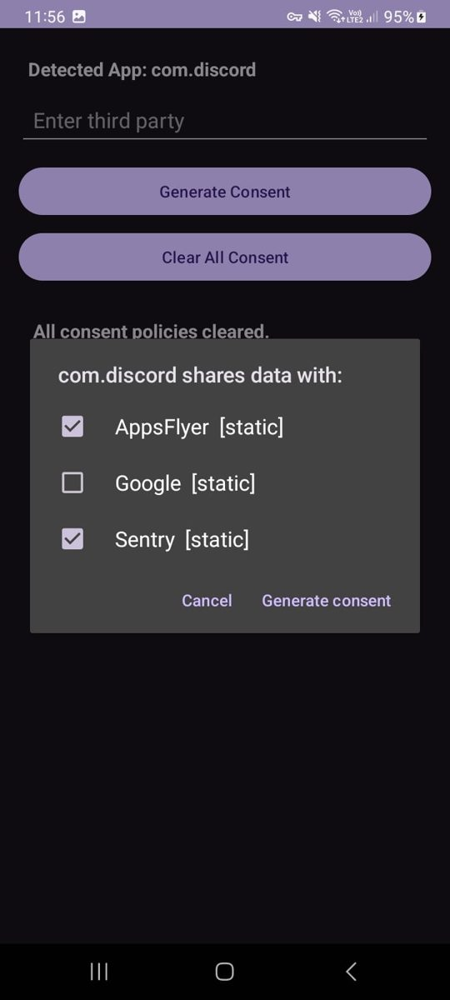
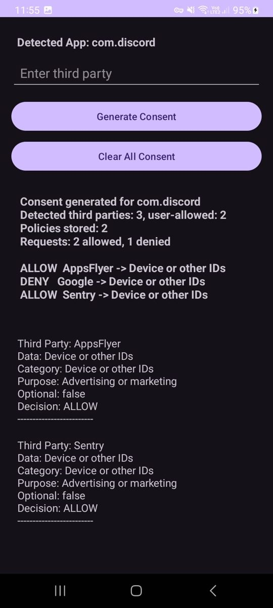
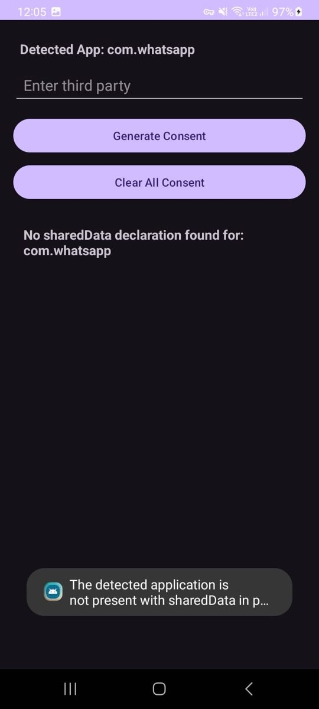

# Recipient-Level Consent Enforcement for Android Apps

Play Store **Data Safety Sections (DSS)** tell users *what* data an app shares and *why*, but never *who* receives it,
and nothing enforces those declarations at runtime. This project builds a consent layer that closes that gap:
third-party SDKs are discovered, the user allows or denies each recipient, and every data-sharing request is checked
against **DSS declaration + user consent** with a **default-deny** policy engine.

> M.Tech project, MANIT Bhopal (Information Security). Author: Divya Rai. Supervisor: Dr. Shweta Bhandari.

## Problem

- **Declared is not actual:** apps declare data sharing in the DSS, but embedded third-party SDKs often contact more parties than the DSS reveals.
- **No recipient control:** users cannot choose which third party receives their data.
- **No runtime enforcement:** nothing checks each SDK request against both the declaration and the user's choice.

## Approach

```
APK + live traffic  ->  third-party discovery  ->  user popup (allow/deny per recipient)
                                                 ->  consent policies (recipient, data, category, purpose)
SDK data request    ->  policy engine: ALLOW only if request == DSS record AND user consented, else DENY
```

**Threat model.** Adversary: a third-party SDK integrated through the consent library that requests data, data types,
or purposes beyond what the user consented to for that recipient. Out of scope: SDKs that bypass the library
(own HTTP client, native networking), rooted devices, malicious host apps. The DSS is treated as truthful input.

## Pilot study (10 real apps)

Discovery combines **static** analysis (class descriptors in every `classes*.dex` matched against
[Exodus Privacy](https://exodus-privacy.eu.org) tracker signatures) and **runtime** analysis
(hostnames from a PCAPdroid capture, ~1-2 min per app, unmatched hostnames reviewed manually).
Aliases are merged into one entity (Firebase, Crashlytics, AdMob = Google).

| Metric | Result |
|---|---|
| Apps analysed | 10 (6 declare sharing, 4 declare none) |
| App-third-party pairs found | 41 (49 raw signatures resolved to 41 entities) |
| Detected by static only / both / runtime only | 33 / 7 / 1 |
| Viber | 22 third-party SDKs vs 8 declared shared-data records |
| Declare no sharing yet contact third parties | Snapchat (3, static), Telegram (Google Firebase, runtime) |
| On-device decisions matching the user's choice | all tested cases (Viber 176/176 requests, twice) |

First-party entities (Meta in Messenger, Google in Google Messages) are excluded from the "declared vs actual" claim.
Full tables: [`results/report.txt`](results/report.txt), [`results/ground_truth.csv`](results/ground_truth.csv).

| Popup | Result | Deny by default |
|---|---|---|
|  |  |  |

More evidence: [Telegram runtime traffic to Firebase](docs/screenshots/pcapdroid_telegram_firebase.jpg),
[Viber 3 of 22 allowed](docs/screenshots/newapp_viber_3_of_22_allowed.jpg),
[pipeline report](docs/screenshots/pipeline_report.jpg).

## Repository layout

| Path | Contents |
|---|---|
| `android/` | Android Studio project: `image-preview` (consent library: `PolicyEngine`, `DataBridge`, `DataSafetyRepository`, `ThirdPartyRepository`) and `app` (Newapp demo with the consent popup) |
| `analysis/` | Python pipeline for the pilot study (APK pull, static scan, runtime scan, ground truth, report) |
| `engine/` | Python port of the policy engine and its experiment harness (`run_experiments.py`) |
| `results/` | Outputs of the pilot study (CSVs, report, app versions) |
| `docs/screenshots/` | Newapp and PCAPdroid evidence |

## Reproduce the analysis

Requirements: Python 3.9+, `adb`, an Android phone with the apps installed, [PCAPdroid](https://github.com/emanuele-f/PCAPdroid).
The analysis scripts use only the Python standard library.

```bash
cd analysis
python 1_pull_apks.py          # adb pull base + split APKs, logs versions and SHA-256
python 2_static_scan.py        # needs trackers.json (Exodus API); writes static_detected.csv
# export PCAPdroid connections as CSV into pcap_raw/ (one combined capture is fine)
python 3a_split_pcap.py        # splits the capture per app
python 3_dynamic_scan.py       # runtime hostnames -> SDK entities
python 4_ground_truth.py       # merge + alias resolution -> ground_truth.csv
python 5_run_consent.py        # consent generation + policy checks (uses ../engine)
python 6_report.py             # report.txt / report.csv
python 7_export_third_parties.py   # third_parties.json for the Android app
```

`apps.csv` lists the 10 packages, `alias_map.json` the entity merges, `dss.json` the 200-app communication-app DSS dataset.
Raw APKs and PCAP captures are not committed (`.gitignore`).

## Run the Android demo

1. Open `android/` in Android Studio (compileSdk 36, minSdk 24).
2. Add your own `app/google-services.json` (not committed; the project applies the Google Services plugin).
3. Run on a device, grant **Usage access** to Newapp, open a target app (e.g. Discord), return to Newapp and tap **Generate Consent**.
4. Tick the third parties to allow; consent policies are stored and each (third party, data record) request is validated, shown as ALLOW or DENY.

`android/image-preview/src/main/assets/third_parties.json` holds the discovered recipients per app (output of the analysis).

## Limitations

- 10-app pilot, one capture session of about 1-2 min per app (Avast, Kakao and Messenger were captured thinly).
- Static detection uses known tracker signatures, so counts are a lower bound; obfuscated or native SDKs can be missed. Encrypted traffic exposes hostnames only.
- Discovery is offline; the library does not yet detect SDKs live inside the app.
- The library is not integrated into the commercial apps; consent is generated and enforced in the Newapp prototype.
- Consent choices in the demos were made by the researcher, not in a user study.

## Future work

Larger dataset (100+ apps), live in-app SDK discovery, payload-level evidence, stronger enforcement
(any HTTP client or native traffic), and a user study of the popup.

## License

MIT, see [`LICENSE`](LICENSE).
